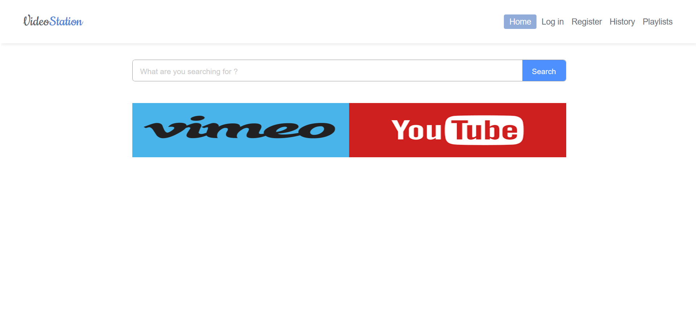
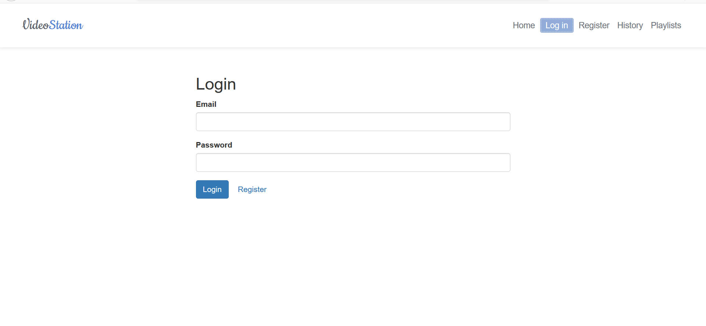
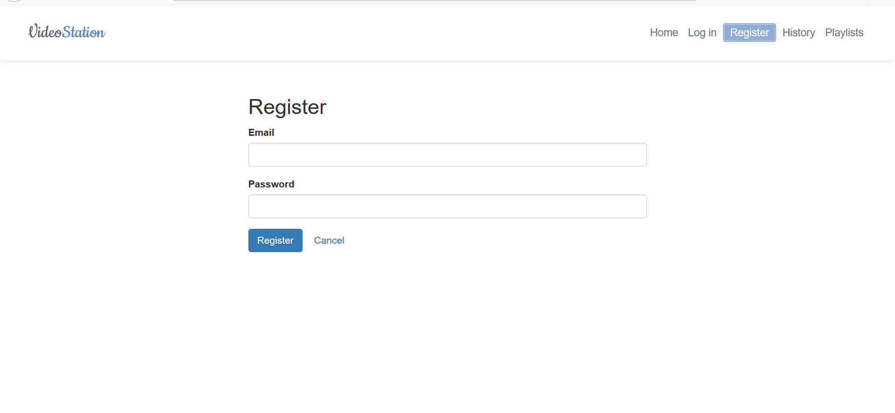
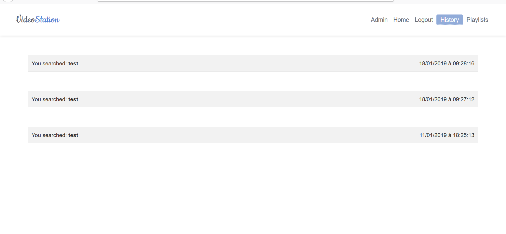
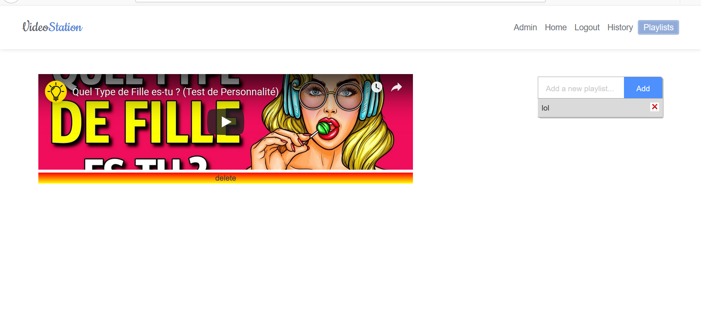
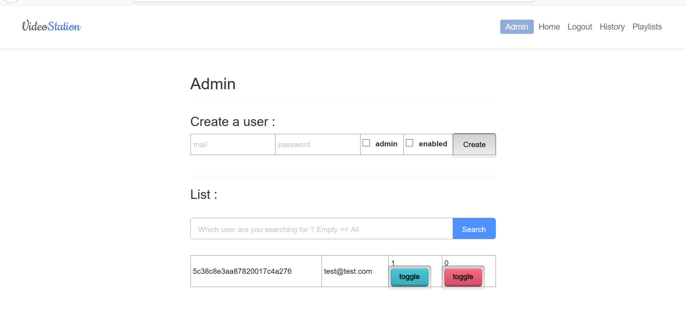

<h1 align="center">
​    VideoStation
</h1>


VideoStation is an application allowing to search videos on YouTube and Vimeo, creating playlists and visualize history of your research.

|       Home         |       Login        |       Register     |
| :----------------: | :----------------: | :----------------: |
|  |  |  |

|       Hitory       |       Playlists    |       Admin        |
| :----------------: | :----------------: | :----------------: |
|  |  |  |

The project contains 6 web servers, 2 pilots and 4 silos.

One pilot containing the video application, distributing requests to different silos. 
And another one for the bonus application "todoApp" that we made already, using the silo "user" of the video application, and another personal silo.

The silos of the video application are "historique", "users", "videos", and the particular silo for todoApp is "tasks".

The backend is developed with [nodeJS](http://nodejs.org/), the frontend with [AngularJS](https://angularjs.org/).

## Getting Started

You can have a preview of the app here : [herokuVideoStation](https://videostation-pilote.herokuapp.com/?fbclid=IwAR1hsPYvGgyYb6BWP-cLP3-zolXrIEVB-NMFv8ejwx-835wPoqgTV_fCRJU#!/).

### Prerequisites

To run this project, you will need :

- [nodeJS](http://nodejs.org/) 9.4.0+
- [MongoDB](https://www.mongodb.com/) 3.4+

### Installing

To build this project, simply clone this repository and install the dependencies of the three servers:

```shell
git clone https://github.com/BanPolytech/VideoStation
```

|     pilote    |      pilote_todolist       |      historique       |
| :-----------: | :------------------------: | :-------------------: |
|  `cd pilote`  | `cd pilote_todolist`       | `cd silos/historique` |
| `npm install` |  `npm install`             |  `npm install`        |

|     tasks          |      users       |      videos       |
| :----------------: | :--------------: | :---------------: |
|  `cd silos/tasks`  | `cd silos/users` | `cd silos/videos` |
| `npm install`      |  `npm install`   |  `npm install`    |

#### Generate SSL certificates

The first step is to create a private key:

```sh
openssl genrsa -des3 -out server_private.key 2048
```

Once the key is generated, issue a certificate signing request:

```sh
openssl req -new -key server_private.key -out server_certificate.csr
```

Now, it is required to enter the pass-phrase when using the key from the `server_private.key` file. Since I assume you will only use the certificate for testing purposes, we can remove the password protection. 

```sh
openssl rsa -in server_private.key -out server_private_clear.key
```

Finally, we have to self-sign the certificate. The created certificate will expire in 365 days after issuing:

```sh
openssl x509 -req -days 365 -in server_certificate.csr -signkey server_private_clear.key -out server_cert_final.crt
```

The self-signed certificate will generate an error in browsers. The reason is that the 
signing certificate authority is unknown and therefore not trusted. But that's okay, it's for testing. ;)

You can now copy the private key (`server_private_clear.key`) and the self-signed certificate (`server_cert_final.crt`)  to the appropriate folder, in `pilote/server-cert`.

### Running

You can run the servers independently, but you need them all to use the app completely:

|     pilote    |      pilote_todolist       |      historique       |
| :-----------: | :------------------------: | :-------------------: |
|  `cd pilote`  | `cd pilote_todolist`       | `cd silos/historique` |
| `node app.js` |  `node app.js`             |  `node app.js`        |

|     tasks          |      users       |      videos       |
| :----------------: | :--------------: | :---------------: |
|  `cd silos/tasks`  | `cd silos/users` | `cd silos/videos` |
| `node app.js`      |  `node app.js`   |  `node app.js`    |

Do not forget to launch the MongoDB server :

` mongod `

_Note: we use the default port 27017_.

_Note: you can specify the folder where to store the database by adding the following option: `--dbpath /path/to/folder`_.

### Usage

Using the default settings, simply browse to https://localhost:8080. You can:

- login
- register
- search videos
- add/delete videos to playlists
- create playlists
- see history
- administrate

## Customization

The project uses YAML config files to define global settings such as: server host, server port, ApiPlaylist endpoints, etc. You can edit them as you like.

|                  Pilot                   |                  Silo                   |
| :--------------------------------------: | :--------------------------------------: |
| `[pilote_name]/config/server-config.yml` `[pilote_name]/config/silos-config.yml` | `silos/[silo_name]/config/server-config.yml` `silos/[silo_name]/config/database-config.yml` |

## Author

- **Esteban GOBERT** - *After work* - [estebangobert](https://github.com/BanPolytech)
- **Cédric JAUBERT** - *After work* - [cedricjaubert](https://github.com/jayceeeeeee)

## License

This project is licensed under the GPLv3 license, see [LICENSE.md](LICENSE.md).# VideoStation
